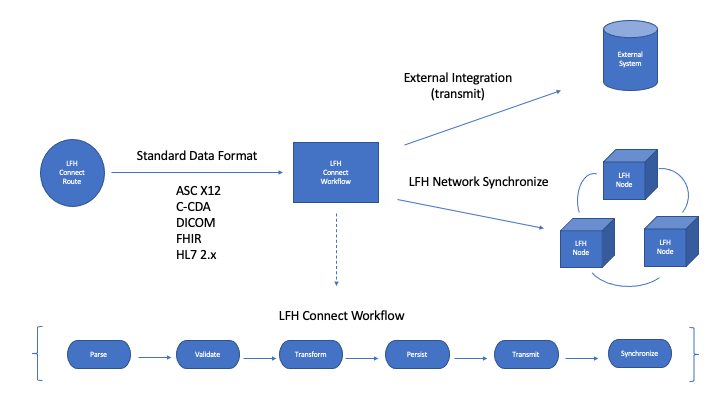

LinuxForHealth Connect Development
**********************************

Overview
========

LinuxForHealth Connect serves as the entry point to the LinuxForHealth platform. LinuxForHealth supports standard health-care formats including:

* ASC X12
* C-CDA
* DICOM 
* FHIR R4
* HL7 2.X

LinuxForHealth Connect consumes inbound data messages using **routes**. Routes are used to encapsulate a standard workflow process. The route is used to capture data within the LinuxForHealth data store prior to its transmission to an external service. This allows LinuxForHealth to integrate within an organization's existing data flows and provide value downstream with an aggregated data store.

LinuxForHealth Routes
=====================

LinuxForHealth routes process data messages using a standard workflow process. Routes are implemented as `FastAPI <https://fastapi.tiangolo.com>`_ endpoints and can support data exchanges using HTTP, REST, and Websockets.

FastAPI endpoints typically use `Pydantic <https://pydantic-docs.helpmanual.io>`_ models to support API requests and responses. LinuxForHealth routes prefer 3rd party libraries to support standard healthcare formats, since the message types within these formats are not generally encapsulated witihn a single model.

LinuxForHealth developers are encouraged to review the following tutorials to become familar with the FastAPI and Pydantic frameworks:

* `Python Type Hints <https://fastapi.tiangolo.com/python-types/>`_
* `FastAPI Tutorial <https://fastapi.tiangolo.com/tutorial/>`_
* `Fast API Advanced Tutorial <https://fastapi.tiangolo.com/advanced/>`_

Standard Workflow Implementation
================================

The standard workflow process provides default implementations for "general" workflow steps which are not specific to the inbound data format. For example, persist is a "general" workflow step which saves inbound data to the LinuxForHealth data store. The validate step is workflow specific since it requires parsing the inbound data format.

The table below lists each standard workflow step and notes which steps are "data format-specific".

+--------------------+----------------------------+-------------------------------------------------------------------------------------------------+
| Workflow Step      | Is Data Format Specific    | Description                                                                                     |
+====================+============================+=================================================================================================+
| Parse              | Y                          | Initial step used to start the workflow.                                                        |
+--------------------+----------------------------+-------------------------------------------------------------------------------------------------+
| Validate           | Y                          | Executes data validations against the inbound data message.                                     |
+--------------------+----------------------------+-------------------------------------------------------------------------------------------------+
| Transform          | Y                          | Executes data updates against the inbound data format.                                          |
+--------------------+----------------------------+-------------------------------------------------------------------------------------------------+
| Persist            | N                          | Stores the inbound data message and metadata in the LinuxForHealth Connect data store.          |
+--------------------+----------------------------+-------------------------------------------------------------------------------------------------+
| Transmit           | N                          | Transmits the inbound data message to an external service, such as a HTTP REST endpoint.        |
+--------------------+----------------------------+-------------------------------------------------------------------------------------------------+
| Sync               | N                          | Applies the inbound data messages to the other nodes within the LinuxForHealth network.         |
+--------------------+----------------------------+-------------------------------------------------------------------------------------------------+
| Error              | N                          | Provides a general error handler if an unhandled exception occurs during the workflow process.  |
+--------------------+----------------------------+-------------------------------------------------------------------------------------------------+

The LinuxForHealth standard workflow is implemented within the  `CoreWorkflow class <https://github.com/LinuxForHealth/pyconnect/blob/main/pyconnect/workflows/core.py#L54>`_. As noted above, the CoreWorkflow class provides implementations for data persistence, transmission, synchronization, and error handling. The CoreWorkflow is extended, or sub-classed, to support specific data formats such as ASC X12, C-CDA, DICOM, FHIR R4, and HL7. The `FHIR R4 Workflow class <https://github.com/LinuxForHealth/pyconnect/blob/main/pyconnect/workflows/fhir.py#L14>`_ is an example of a format specific implementation.

Implementing A New Route
========================

A LinuxForHealth route supports a single data format. The route may support multiple versions of the format if the versions are handled appropriately in the workflow's validation and transform steps.

Data formats are best supported by external libraries which support the breadth of a data format specification with parsing, modeling, and validation services. In other words, data modeling code should not be checked into the LinuxForHealth `connect` project.

Complete the following steps to add a new route:

#. Create a new workflow:
    #. Add a new workflow module to the `main <https://github.com/LinuxForHealth/pyconnect/tree/main/pyconnect/workflows>`_ and `test <https://github.com/LinuxForHealth/pyconnect/tree/main/tests/workflows>`_ packages.
    #. Create a new class in your new workflow module to support the data format. Provide a validate and, optionally, a transform method implementation to support the format.
    #. Ensure that test cases for the workflow cover the methods implemented in the new workflow class.
#. Create new routes:
    #. Add a new route module to the `main <https://github.com/LinuxForHealth/pyconnect/tree/main/pyconnect/routes>`_ and `test <https://github.com/LinuxForHealth/pyconnect/tree/main/tests/routes>`_ packages.
    #. Determine which HTTP verbs are required to support the data format and it's messaging interface.
    #. Complete test cases for the new routes. The test cases should validate the status codes and response body returned by the routes. Note that the test cases will fail until the routes are implemented.
    #. Create a route for each HTTP verb. Determine if the route will use Pydantic based request and response models, or defer to a 3rd party library.
#. Register the routes within the LinuxForHealth `api module <https://github.com/LinuxForHealth/pyconnect/blob/main/pyconnect/routes/api.py>`_

When the routes are complete, the endpoints will be available in the `OpenAPI UI <https://localhost:5000/docs>`_
