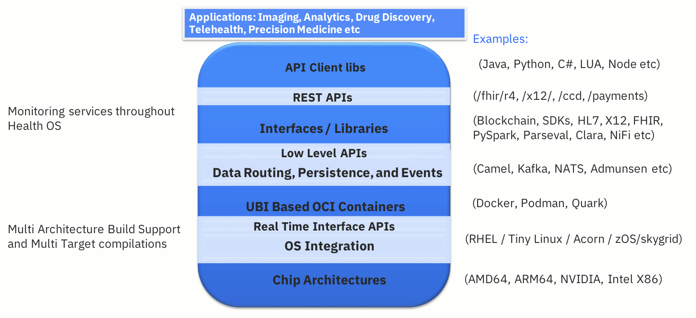
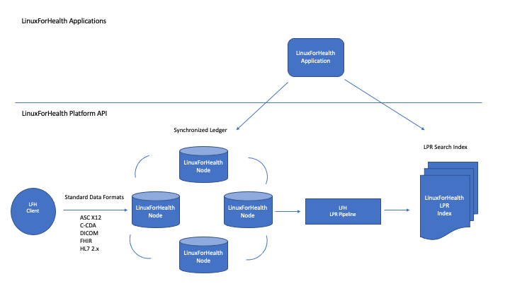
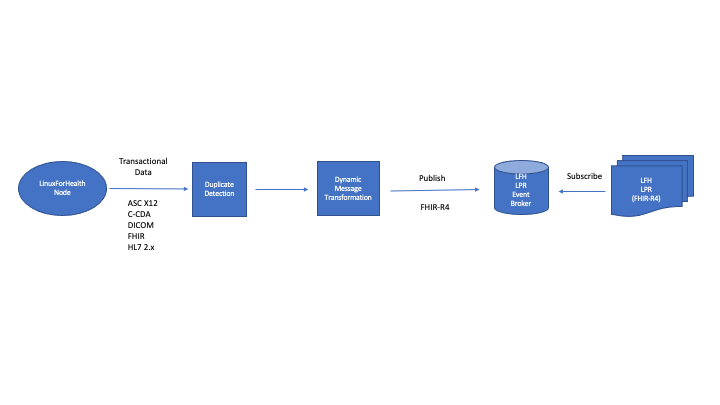
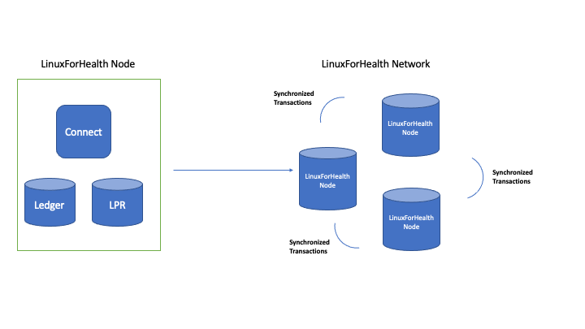
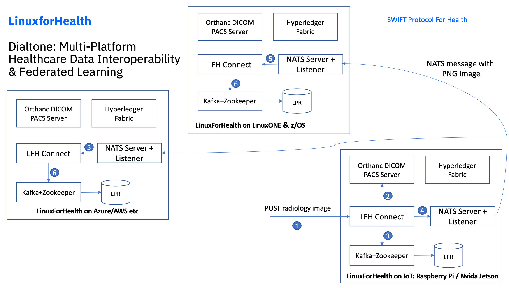

What is LinuxForHealth?
*************************
Welcome to the future of healthcare software development - the world's first true enabled HealthOS.

LinuxForHealth is a distributed processing network operating system which allows mainframes, cloud and edge devices to be seamlessly connected directly to healthcare transaction systems. The processing model abstracts the need for intermediary third-party organizations, resulting in a developer-extensible trust protocol.

The LinuxForHealth architecture builds on successive levels of industry standards, from AMD64, ARM64 and NVIDIA chip architectures to Docker and PodMan containers, supporting an extensible set of APIs accessible via multiple languages.

This architecture facilitates these key LinuxForHealth features:

* An open source interoperable health stack to enable developers to build further platforms and applications
* Connectivity across mainframes, embedded devices, multi-cloud and LinuxONE
* Data acquisition, integration, routing
* Real-time and batch processing
* Abstraction of the details of health standards, enabling extensibility, modularity, scalability
* Community support & enterprise readiness

LinuxForHealth has captured the attention of industry leaders.  While the project is in its nascent stages, leading companies are already committing significant features, including APIs and build recipes that support LFH deployment from embedded device, fully distributed agent-based, multi-tenant multi cloud and LinuxONE distributions.

You can get started by visiting our `developer setup page <./developer-setup.html>`_ and visit us on `Github <https://github.com/linuxforhealth/connect>`_.  We hope you join our journey in creating LinuxForHealth, the world's first true HealthOS.

LinuxForHealth Ecosystem
=========================

Applications that use the LFH OS are able to leverage its distributed ledger and healthcare transaction processing capabilities. This offers the following advantages for LFH applications:   

* High Availability and Redundancy with no single point of failure
* Scales horizontally
* Indexed LPR updated in real-time
* Abstracts health messaging interfaces
* Compatible with existing Health IT infrastructure

LinuxForHealth Longitudinal Patient Record (LPR)
================================================

Each LPR node consists of a robust data processing pipeline which ingests a variety of transactional healthcare data (X-12, C-CDA, DICOM, FHIR, HL7v2), runs it through a duplicate detection processor, and transforms the data into FHIR R4 for persistence and maintenance of the centralized LPR.

* Data ingestion
* Data transformation to standardized LFH message format
* Persist into LPR

LinuxForHealth Connect
======================

Each LFH node is comprised of the connect application, the ledger and data persistence for the LPR.
* `connect` application
* Ledger
* LPR (Longitudinal Patient Record) datastore 

   

LinuxForHealth Workflow
=======================

.. image:: images/LinuxForHealthWorkflow.png
   :width: 600
   :alt: LinuxForHealth

LFH workflow consists of distinct steps for interfacing applications - these are described below:

Parse
-----
LinuxForHealth connect receives an inbound data message.

Validate
--------
Validates data for completeness and accuracy. This is key to ensuring that data persisted within the OS is consistent for use by downstream steps in the workflow.

Transform
---------
Optional step used for applying data transformations and updates to validated data.

Persist
-------
Data is persisted into the LPR store. Metadata is also created and provided to ledger storage and search services.

Transmit
--------
Optional step which transmits the validated data message to an external system.

Synchronize
-----------
Broadcasts the data message to the LinuxForHealth network, applying the message to the other nodes.

LinuxForHealth Dialtone Example
================================

   
   
.. toctree::
   :maxdepth: 3
   :caption: Getting Started:

   developer-setup.rst
   tutorials/quickstart.rst
   application-configuration.rst
   message-structure.rst

.. toctree::
   :maxdepth: 3
   :caption: Routes:

   routes/fhir-r4.rst

.. toctree::
   :maxdepth: 3
   :caption: Develop:

   develop/develop.rst

.. toctree::
   :maxdepth: 3
   :caption: Deployment:

   deployment/compose.rst
   deployment/container.rst
   deployment/kubernetes.rst

