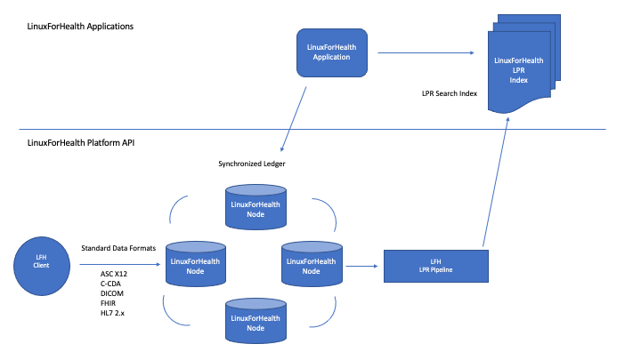
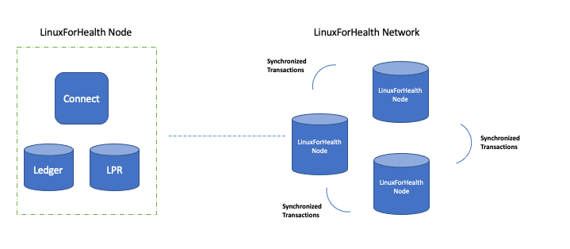

What is LinuxForHealth?
*************************
Welcome to the future of healthcare software development - the world's first true enabled HealthOS.

LinuxForHealth is a distributed processing network operating system which allows mainframes, cloud and edge devices to be seamlessly connected directly to healthcare transaction systems. The processing model abstracts the need for intermediary third-party organizations, resulting in a developer-extensible trust protocol.

The LinuxForHealth architecture builds on successive levels of industry standards, from AMD64, ARM64 and NVIDIA chip architectures to Docker and PodMan containers, supporting an extensible set of APIs accessible via multiple languages.

.. image:: images/LinuxForHealthArch.png
   :width: 600
   :alt: LinuxForHealth  

This architecture facilitates these key LinuxForHealth features:

* An open source interoperable health stack to enable developers to build further platforms and applications
* Connectivity across embedded devices, multi-cloud and LinuxONE
* Data acquisition, integration, routing
* Real-time and batch processing
* Abstraction of the details of health standards, enabling extensibility, modularity, scalability
* Community support & enterprise readiness

LinuxForHealth has captured the attention of industry leaders.  While the project is in its nascent stages, leading companies are already committing significant features, including APIs and build recipes that support LFH deployment from embedded device, fully distributed agent-based, multi-tenant multi cloud and LinuxONE distributions.

You can get started by visiting our `developer setup page <./developer-setup.html>`_ and visit us on `Github <https://github.com/linuxforhealth/connect>`_.  We hope you join our journey in creating LinuxForHealth, the world's first true HealthOS.

LinuxForHealth Eco-system
=========================

   

LinuxForHealth Longitudinal Patient Record (LPR)
================================================

.. image:: images/LinuxForHealthLPRProcessing.png
   :width: 600
   :alt: LinuxForHealth

LinuxForHealth Connect
======================

   

LinuxForHealth Workflow
=======================

.. image:: images/LinuxForHealthWorkflow.png
   :width: 600
   :alt: LinuxForHealth
   

.. toctree::
   :maxdepth: 3
   :caption: Getting Started:

   developer-setup.rst
   tutorials/quickstart.rst
   application-configuration.rst
   message-structure.rst

.. toctree::
   :maxdepth: 3
   :caption: Routes:

   routes/fhir-r4.rst

.. toctree::
   :maxdepth: 3
   :caption: Develop:

   develop/develop.rst

.. toctree::
   :maxdepth: 3
   :caption: Deployment:

   deployment/compose.rst
   deployment/container.rst
   deployment/kubernetes.rst

